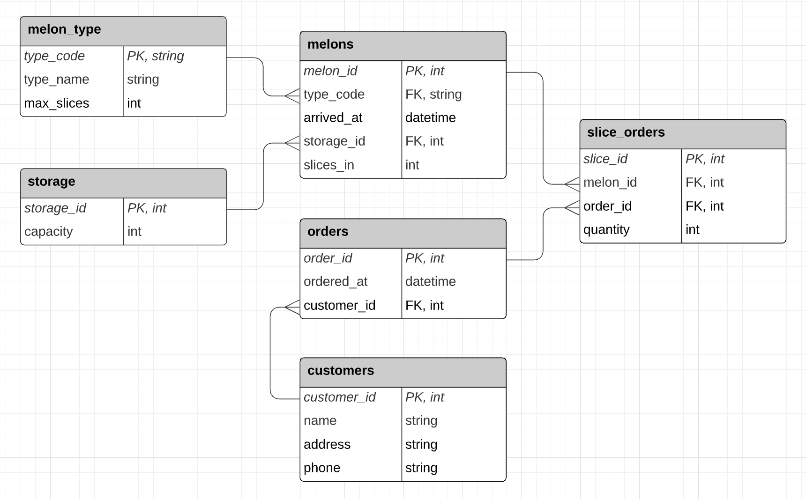

Solution
========

There's no single right answer here, but a good start could be:

How would this translate to a model.py file?

.. literalinclude:: model.py
    :end-before: connect_to_db
    :name: ptpy-model
    :caption:

Download Solution
------------------

.. parsed-literal::
  :class: console

  $ `hbget data-modeling --homework --solution`:cmd:

Setup
-----

In the solution directory, create a new virtual environment and activate it:

.. parsed-literal::
  :class: console

  $ |venvcmd| `env`:cmd:
  $ `source env/bin/activate`:cmd:

Install requirements:

.. parsed-literal::
  :class: console

  (env) $ |pipcmd| `install -r requirements.txt`:cmd:

Create the database and load the ubermelon.sql file:

.. parsed-literal::
  :class: console

  (env) $ `createdb ubermelon`:cmd:
  (env) $ `psql ubermelon < ubermelon.sql`:cmd:

Now you can interactively run the model.py file and query the database:

.. parsed-literal::
  :class: console

  (env) $ |pycmd| `-i model.py`:cmd:
  Connected to the db!
  >>>

Queries
-------

1. Find any customers whose name includes 'Lindsey'.

   .. togglereveal::

     .. parsed-literal::

       >>> lindseys = Customer.query.filter(Customer.name.like('%Lindsey%')).all()
       >>> print(lindseys)
       [<Customer customer_id=1 name=Ryan Lindsey>, <Customer customer_id=5 name=Lindsey Braun>]

2. Check that customers are connected to orders by finding all orders
   connected to the first Lindsey.

   .. togglereveal::

     .. parsed-literal::

       >>> lindsey_orders = lindseys[0].orders
       >>> print(lindsey_orders)
       [<Order order_id=1 customer_id=1>, <Order order_id=2 customer_id=1>, <Order order_id=3 customer_id=1>]

3. Check that melon_types are connected to storage via melons by finding
   the melon_type names in storage space 16.

   .. togglereveal::

     .. parsed-literal::

       >>> storage_16 = StorageSpace.query.get(16)
       >>> names = [melon.melon_type.type_name for melon in storage_16.melons]
       >>> print(names)
       ['Casaba', 'Crenshaw', 'Casaba']

4. Find all orders with watermelons.

   .. togglereveal::

     .. parsed-literal::

       >>> watermelons = Melon.query.filter_by(type_code="wat").all()
       >>> orders = set()
       >>> for melon in watermelons:
       >>> ... for slice in melon.slices:
       >>> ... ... orders.add(slice.order)
       >>> print(orders)
       {<Order order_id=15 customer_id=5>, <Order order_id=14 customer_id=5>,
        <Order order_id=6 customer_id=2>, <Order order_id=12 customer_id=4>,
        <Order order_id=2 customer_id=1>, <Order order_id=4 customer_id=2>,
        <Order order_id=11 customer_id=4>, <Order order_id=3 customer_id=1>}